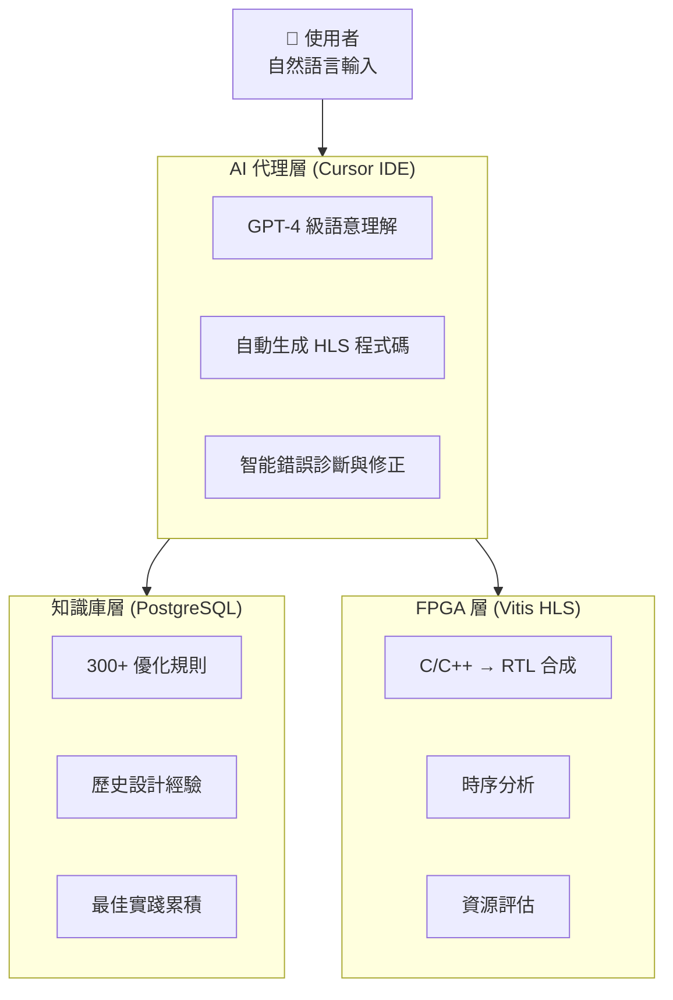

[English](./README_EN.md) | **繁體中文**

# Cursor-HLS-Forge

## AI 代理 + 知識庫驅動的 HLS/FPGA 自動設計驗證平台

> 讓硬體開發像軟體一樣敏捷 — 將數月開發縮短至數小時

---

## 專案簡介

**Cursor-HLS-Forge** 是 AICOFORGE 平台的核心開源元件，展示如何透過 AI 代理（Cursor IDE）結合結構化知識庫（PostgreSQL），實現 HLS/FPGA 設計的自動化優化與驗證。

### 核心價值

| 指標 | 成果 |
|:---:|:---:|
| **99.6%** | 性能提升（II: 264 → 1 週期）|
| **2 小時** | 完成傳統需 2-3 週的工作 |
| **300+** | 知識規則庫自動應用 |
| **90%+** | 設計重現成功率（對比通用 AI 的 60%） |

---

## FIR 濾波器優化實例

本專案以 128-tap FIR 濾波器為例，展示 AI 如何透過知識庫引導，逐步將設計從未優化狀態提升至最佳效能。

### 優化迭代歷程

```
Iteration #1   →   #2   →   #3   →   #4   →   #5
          II=264   II=134   II=128   II=2     II=1
          ━━━━━━━━━━━━━━━━━━━━━━━━━━━━━━━━━━━━━━━━━▶
                    99.6% 性能提升
```

| 迭代 | 優化方法 | II 達成 | 資源使用 | 應用規則 |
|:---:|:---|:---:|:---|:---|
| #1 | 基準設計：分離的 shift 與 MAC 迴圈 | 264 | DSP=1 | — |
| #2 | 迴圈合併：使用三元運算子整合 | 134 | DSP=1 | P001 |
| #3 | Pipeline Rewind：有限迴圈優化 | 128 | DSP=1 | P002 |
| #4 | Array Partition + Unroll | 2 | DSP=2, BRAM=2 | P003, P004 |
| #5 | 完整分割 + 串流 AXIS 介面 | **1** | DSP=2, LUT=2306, FF=4772 | P002-P004, R001, R025, R061 |

---

## 展示影片與操作流程

### Demo 1：從知識庫查詢所有 FIR 設計迭代

**影片連結**：[cursor-hls-demo：list_all_fir_design_iters_from_KB](https://youtu.be/FWsERNTDri4)

#### 操作流程

**使用者輸入**：
> "please list all fir design iterations from current KB including ii/resources/used prompts/inference rules"

**AI 代理執行過程**：

1. **環境確認** — AI 首先確認 Vitis HLS 工具是否可用
2. **查詢知識庫** — 呼叫 KB API 取得所有 FIR 設計紀錄
3. **修正錯誤** — AI 一開始設定 `limit=50`，但 API 限制最大為 20，自動修正後重新查詢
4. **取得程式碼** — 針對每個迭代，進一步取得完整程式碼與註解
5. **整理報告** — 產出結構化的迭代清單，包含效能指標與應用規則

#### AI 自我修正範例

```
第一次嘗試：curl "$KB_API/api/design/similar?project_type=fir&limit=50"
API 回應：  {"detail": "Input should be less than or equal to 20"}

自動修正：  curl "$KB_API/api/design/similar?project_type=fir&limit=20"
成功取得：  5 筆 FIR 設計迭代紀錄
```

---

### Demo 2：重現知識庫中的 FIR 設計 Iteration #5

**影片連結**：[cursor-hls-demo：reproduce_fir_design_iter5_from_KB](https://youtu.be/5d8HyciMdag)

#### 操作流程

**使用者輸入**：
> "please reproduce fir design iteration 5, and verify its csim/csynth results are matched"

**AI 代理執行過程**：

1. **專案探索** — 確認本地專案結構與檔案
2. **知識庫查詢** — 取得 Iteration #5 的完整程式碼與預期指標
3. **程式碼部署** — 將 KB 中的設計程式碼寫入本地檔案
4. **執行驗證** — 透過 `vitis_hls -f run_hls.tcl` 執行 C 模擬與合成
5. **結果比對** — 確認合成結果與 KB 紀錄一致

#### AI 自我修正範例

**問題**：第一次執行 C 模擬時出現大量數值不匹配

```
首次執行結果：
  Mismatch at sample 0: hw=0 sw=-2423
  Mismatch at sample 1: hw=1 sw=-31427
  ...
```

**原因分析**：測試平台（testbench）的參考模型與硬體設計的係數或計算邏輯不一致

**修正過程**：AI 檢查並修正測試平台的軟體參考函數，確保與硬體實作使用相同的係數表和計算方式

**最終結果**：
```
✓ C Simulation: "Test passed with 256 samples."
✓ C Synthesis:  II=1, Latency=9, DSP=2, LUT=2306, FF=4772, BRAM=0
                與知識庫紀錄完全吻合
```

---

## 系統架構



---

## 知識庫 API 端點

| 端點 | 功能 |
|:---|:---|
| `GET /api/design/similar` | 查詢相似設計案例 |
| `GET /api/design/{id}/code` | 取得特定迭代的完整程式碼 |
| `GET /api/rules/effective` | 取得有效優化規則 |
| `POST /api/design/complete_iteration` | 記錄新的設計迭代 |

---

## 效能指標說明

- **II (Initiation Interval)**：連續資料處理的間隔週期數，II=1 表示每週期可處理一筆資料
- **Latency**：單筆資料從輸入到輸出的總延遲週期
- **DSP**：數位訊號處理單元使用量
- **LUT**：查找表邏輯資源使用量
- **FF**：暫存器使用量
- **BRAM**：區塊記憶體使用量

---

## 快速開始

### 環境需求

- Xilinx Vitis HLS 2022.1+
- PostgreSQL（用於知識庫）
- Cursor IDE（AI 代理介面）

### 執行範例

```bash
# 進入 FIR 範例目錄
cd examples/fir128

# 執行 HLS 流程（C 模擬 + 合成）
vitis_hls -f run_hls.tcl
```

---

## 相關連結

- **AICOFORGE 官網**：[aicoforge.com](https://aicoforge.com)
- **FPGA 環境設置專案**：[cursor-fpga-forge](https://github.com/aicoforge/cursor-fpga-forge)
- **Demo 影片播放清單**：[YouTube Channel](https://www.youtube.com/@aicoforge)

---

## 授權條款

MIT License

---

## 關於 AICOFORGE

AICOFORGE 是一個 AI 代理 + FPGA 自動設計驗證平台，致力於讓硬體開發像軟體一樣敏捷。我們與台灣大學電機系賴瑾教授（前威盛電子 CTO 暨創辦人）共同研發 LLM2HLS 理論技術，結合學術創新與產業實戰經驗。

**聯絡我們**：kevinjan@aicoforge.com
