[English](./README_EN.md) | **繁體中文**

# Cursor-HLS-Forge

## AI 代理 + 知識庫驅動的 HLS/FPGA 自動設計驗證平台

> 讓硬體開發像軟體一樣敏捷 — 將數月開發縮短至數小時

---

## 專案簡介

**Cursor-HLS-Forge** 是 AICOFORGE 平台的核心技術，展示如何透過 AI 代理（Cursor IDE）結合結構化知識庫（PostgreSQL），實現 HLS/FPGA 設計的自動化優化與驗證。

### 核心價值

| 指標 | 成果 |
|:---:|:---:|
| **99.6%** | 性能提升（II: 264 → 1 週期）|
| **2 小時** | 完成傳統需 2-3 週的工作 |
| **300+** | 知識規則庫自動應用 |
| **90%+** | 設計重現成功率（對比通用 AI 的 60%） |

---

## FIR 濾波器優化實例

本專案以 128-tap FIR 濾波器為例，展示 AI 如何透過知識庫引導，逐步將設計從未優化狀態提升至最佳效能。

### 優化迭代歷程

```
Iteration #1   →   #2   →   #3   →   #4   →   #5
          II=264   II=134   II=128   II=2     II=1
          ━━━━━━━━━━━━━━━━━━━━━━━━━━━━━━━━━━━━━━━━━▶
                    99.6% 性能提升
```

| 迭代 | 優化方法 | II 達成 | 資源使用 | 應用規則 |
|:---:|:---|:---:|:---|:---|
| #1 | 基準設計：分離的 shift 與 MAC 迴圈 | 264 | DSP=1 | — |
| #2 | 迴圈合併：使用三元運算子整合 | 134 | DSP=1 | P001 |
| #3 | Pipeline Rewind：有限迴圈優化 | 128 | DSP=1 | P002 |
| #4 | Array Partition + Unroll | 2 | DSP=2, BRAM=2 | P003, P004 |
| #5 | 完整分割 + 串流 AXIS 介面 | **1** | DSP=2, LUT=2306, FF=4772 | P002-P004, R001, R025, R061 |

---

## 展示影片與操作流程

### Demo 1：從知識庫查詢所有 FIR 設計迭代

**影片連結**：[cursor-hls-demo：list all fir design iters from KB](https://youtu.be/FWsERNTDri4)

#### 操作流程

**使用者輸入**：
> "please list all fir design iterations from current KB including ii/resources/used prompts/inference rules"

**AI 代理執行過程**：

1. **環境確認** — AI 首先確認 Vitis HLS 工具是否可用
2. **查詢知識庫** — 呼叫 KB API 取得所有 FIR 設計紀錄
3. **修正錯誤** — AI 一開始設定 `limit=50`，但 API 限制最大為 20，自動修正後重新查詢
4. **取得程式碼** — 針對每個迭代，進一步取得完整程式碼與註解
5. **整理報告** — 產出結構化的迭代清單，包含效能指標與應用規則

#### AI 自我修正範例

```
第一次嘗試：curl "$KB_API/api/design/similar?project_type=fir&limit=50"
API 回應：  {"detail": "Input should be less than or equal to 20"}

自動修正：  curl "$KB_API/api/design/similar?project_type=fir&limit=20"
成功取得：  5 筆 FIR 設計迭代紀錄
```

---

### Demo 2：重現知識庫中的 FIR 設計 Iteration #5

**影片連結**：[cursor-hls-demo：reproduce fir design iter5 from KB](https://youtu.be/5d8HyciMdag)

#### 操作流程

**使用者輸入**：
> "please reproduce fir design iteration 5, and verify its csim/csynth results are matched"

**AI 代理執行過程**：

1. **專案探索** — 確認本地專案結構與檔案
2. **知識庫查詢** — 取得 Iteration #5 的完整程式碼與預期指標
3. **程式碼部署** — 將 KB 中的設計程式碼寫入本地檔案
4. **執行驗證** — 透過 `vitis_hls -f run_hls.tcl` 執行 C 模擬與合成
5. **結果比對** — 確認合成結果與 KB 紀錄一致

#### AI 自我修正範例

**問題**：第一次執行 C 模擬時出現大量數值不匹配

```
首次執行結果：
  Mismatch at sample 0: hw=0 sw=-2423
  Mismatch at sample 1: hw=1 sw=-31427
  ...
```

**原因分析**：測試平台（testbench）的參考模型與硬體設計的係數或計算邏輯不一致

**修正過程**：AI 檢查並修正測試平台的軟體參考函數，確保與硬體實作使用相同的係數表和計算方式

**最終結果**：
```
✓ C Simulation: "Test passed with 256 samples."
✓ C Synthesis:  II=1, Latency=9, DSP=2, LUT=2306, FF=4772, BRAM=0
                與知識庫紀錄完全吻合
```

---

### Demo 3：無 KB 架構模板 vs 有 KB 架構模板設計 Systolic Array

**影片連結**：[cursor-hls-demo：design systolic without KB patterns vs with KB patterns](https://youtu.be/ERsgSPnBJZo)

#### 操作流程

**使用者輸入**：
> "design an 8x8 systolic array for matrix multiplication. first attempt without query KB architecture patterns, then attempt with KB architecture patterns, compare both results"

**AI 代理執行過程**：

1. **環境確認** — 確認 Vitis HLS 工具可用
2. **基準設計** — 不查詢 KB，直接設計 8x8 systolic array
3. **知識庫查詢** — 呼叫 KB API 取得 systolic 架構模板與優化規則
4. **優化設計** — 應用 KB 中的架構模板進行重新設計
5. **合成驗證** — 分別執行 csim/csynth 驗證兩種設計
6. **比較分析** — 產出完整比較報告

#### KB 查詢結果

```bash
# 查詢相似設計
curl "http://192.168.1.11:8000/api/design/similar?project_type=matmul&limit=10"

# 取得參考設計：Systolic8x8_Wavefront
# 架構特徵：Boundary injection + single time-loop (t=0..3N-3)
# 關鍵 Pragmas：a_pipe/b_pipe complete partition, PIPELINE II=1, full UNROLL
```

#### 優化歷程

| 設計階段 | II | 提升倍數 | 應用的 KB 知識 |
|:---|:---:|:---:|:---|
| Baseline（無 KB） | 588 | — | 無 |
| 應用 KB 規則（無輸入分割） | 73 | 8x | P003, P004, R035, P099 |
| 完整輸入陣列分割 | **1** | 73x | + Input Array Partition |
| 串流介面設計 | **1** | 73x | + KB 參考模板（Streams） |

**總效能提升：588x**（II: 588 → 1）

#### 關鍵 KB 規則

| 規則代碼 | 說明 |
|:---:|:---|
| P099 | Input skew logic（最常見 systolic 錯誤） |
| P003 | 完整重疊 load/compute/store |
| P004 | 無跨迭代相依性 |
| R035 | Pipeline 最內層迴圈 |

#### 最終結果

```
✓ Baseline Design:
  II=588, Latency=N/A, DSP=1, LUT=558, FF=123

✓ II=1 Partitioned Design:
  II=1, Latency=45 cycles, Pipeline Depth=4, Fmax=271.15 MHz

✓ II=1 Stream Design (KB Reference Pattern):
  II=1, Latency=~22 cycles/batch, Pipeline Depth=5, Fmax=144.68 MHz

結論：KB 架構模板實現 588x 效能提升！
```

---

## 系統架構

```mermaid
flowchart TB
    User["👤 使用者<br/>自然語言輸入"]
    
    subgraph AI["AI 代理層 (Cursor IDE)"]
        AI1["GPT-4 級語意理解"]
        AI2["自動生成 HLS 程式碼"]
        AI3["智能錯誤診斷與修正"]
    end
    
    subgraph KB["知識庫層 (PostgreSQL)"]
        KB1["300+ 優化規則"]
        KB2["歷史設計經驗"]
        KB3["最佳實踐累積"]
    end
    
    subgraph FPGA["FPGA 層 (Vitis HLS)"]
        FPGA1["C/C++ → RTL 合成"]
        FPGA2["時序分析"]
        FPGA3["資源評估"]
    end
    
    User --> AI
    AI --> KB
    AI --> FPGA
```



---

## 知識庫 API 端點

| 端點 | 功能 |
|:---|:---|
| `GET /api/design/similar` | 查詢相似設計案例 |
| `GET /api/design/{id}/code` | 取得特定迭代的完整程式碼 |
| `GET /api/rules/effective` | 取得有效優化規則 |
| `POST /api/design/complete_iteration` | 記錄新的設計迭代 |

---

## 效能指標說明

- **II (Initiation Interval)**：連續資料處理的間隔週期數，II=1 表示每週期可處理一筆資料
- **Latency**：單筆資料從輸入到輸出的總延遲週期
- **DSP**：數位訊號處理單元使用量
- **LUT**：查找表邏輯資源使用量
- **FF**：暫存器使用量
- **BRAM**：區塊記憶體使用量

---

## 快速開始

### 環境需求

- Xilinx Vitis HLS 2022.1+
- PostgreSQL（用於知識庫）
- Cursor IDE（AI 代理介面）

### 執行範例

```bash
# 進入 FIR 範例目錄
cd examples/fir128

# 執行 HLS 流程（C 模擬 + 合成）
vitis_hls -f run_hls.tcl
```

---

## 相關連結

- **AICOFORGE 官網**：[aicoforge.com](https://aicoforge.com)
- **FPGA 環境設置專案**：[cursor-fpga-forge](https://github.com/aicoforge/cursor-fpga-forge)
- **Demo 影片播放清單**：[YouTube Channel](https://www.youtube.com/@aicoforge)

---

## 授權條款

MIT License

---

## 關於 AICOFORGE

AICOFORGE 是一個 AI 代理 + FPGA 自動設計驗證平台，致力於讓硬體開發像軟體一樣敏捷。我們與台灣大學電機系賴瑾教授（前威盛電子 CTO 暨創辦人）共同研發 LLM2HLS 理論技術，結合學術創新與產業實戰經驗。

---

## 系統架構與技術來源

### AICOFORGE 平台

**AICOFORGE** 開發的 HLS Knowledge Base System 包含：

- 知識庫架構（PostgreSQL + FastAPI）
- 基礎規則庫（官方規則）
- AI 推理框架（.cursorrules 整合）

### 授權聲明

AICOFORGE 平台提供學術開源版本，與我們聯繫後可取得程式碼與文件：

**允許使用範圍**
- 非商業性教學研究
- 學術成果發表
- 開源專案貢獻

**限制使用範圍**
- 營利性產品開發
- 技術轉授權
- 完整系統複製販售

**技術來源**：[github.com/aicoforge](https://github.com/aicoforge)  
**商業合作**：kevinjan@aicoforge.com
