**English** | [繁體中文](./README.md)

# Cursor-HLS-Forge

## AI Agent + Knowledge Base Driven HLS/FPGA Automated Design Verification Platform

> Making Hardware Development as Agile as Software — Reduce Months to Hours

---

## Overview

**Cursor-HLS-Forge** is the core technology of the AICOFORGE platform, demonstrating how AI agents (Cursor IDE) combined with a structured knowledge base (PostgreSQL) can automate HLS/FPGA design optimization and verification.

### Key Metrics

| Metric | Achievement |
|:---:|:---:|
| **99.6%** | Performance improvement (II: 264 → 1 cycles) |
| **2 hours** | Complete work traditionally requiring 2-3 weeks |
| **300+** | Knowledge rules automatically applied |
| **90%+** | Design reproduction success rate (vs. 60% for general AI) |

---

## FIR Filter Optimization Case Study

This project uses a 128-tap FIR filter to demonstrate how AI, guided by a knowledge base, progressively optimizes a design from baseline to peak performance.

### Optimization Journey

```
Iteration #1   →   #2   →   #3   →   #4   →   #5
          II=264   II=134   II=128   II=2     II=1
          ━━━━━━━━━━━━━━━━━━━━━━━━━━━━━━━━━━━━━━━━━▶
                    99.6% Performance Gain
```

| Iter | Optimization Approach | II Achieved | Resources | Rules Applied |
|:---:|:---|:---:|:---|:---|
| #1 | Baseline: Separate shift and MAC loops | 264 | DSP=1 | — |
| #2 | Loop merge: Combined with ternary operator | 134 | DSP=1 | P001 |
| #3 | Pipeline Rewind: Finite loop optimization | 128 | DSP=1 | P002 |
| #4 | Array Partition + Unroll | 2 | DSP=2, BRAM=2 | P003, P004 |
| #5 | Complete partition + Streaming AXIS | **1** | DSP=2, LUT=2306, FF=4772 | P002-P004, R001, R025, R061 |

---

## Demo Videos & Workflow

### Demo 1: Query All FIR Design Iterations from Knowledge Base

**Video**: [cursor-hls-demo：list_all_fir_design_iters_from_KB](https://youtu.be/FWsERNTDri4)

#### Workflow

**User Input**:
> "please list all fir design iterations from current KB including ii/resources/used prompts/inference rules"

**AI Agent Execution**:

1. **Environment Check** — Verify Vitis HLS tool availability
2. **KB Query** — Call KB API to retrieve all FIR design records
3. **Self-Correction** — Initial query used `limit=50`, but API max is 20; automatically corrected
4. **Code Retrieval** — Fetch complete code and comments for each iteration
5. **Report Generation** — Produce structured iteration list with metrics and applied rules

#### AI Self-Correction Example

```
First attempt: curl "$KB_API/api/design/similar?project_type=fir&limit=50"
API response:  {"detail": "Input should be less than or equal to 20"}

Auto-corrected: curl "$KB_API/api/design/similar?project_type=fir&limit=20"
Success:        Retrieved 5 FIR design iteration records
```

---

### Demo 2: Reproduce FIR Design Iteration #5 from Knowledge Base

**Video**: [cursor-hls-demo：reproduce_fir_design_iter5_from_KB](https://youtu.be/5d8HyciMdag)

#### Workflow

**User Input**:
> "please reproduce fir design iteration 5, and verify its csim/csynth results are matched"

**AI Agent Execution**:

1. **Project Exploration** — Verify local project structure and files
2. **KB Query** — Retrieve Iteration #5 complete code and expected metrics
3. **Code Deployment** — Write KB design code to local files
4. **Run Verification** — Execute C simulation and synthesis via `vitis_hls -f run_hls.tcl`
5. **Result Comparison** — Confirm synthesis results match KB records

#### AI Self-Correction Example

**Issue**: First C simulation run showed numerous value mismatches

```
Initial run output:
  Mismatch at sample 0: hw=0 sw=-2423
  Mismatch at sample 1: hw=1 sw=-31427
  ...
```

**Root Cause**: Testbench software reference model had inconsistent coefficients or calculation logic compared to hardware design

**Correction Process**: AI inspected and fixed the testbench's software reference function to ensure identical coefficient table and calculation method as hardware implementation

**Final Result**:
```
✓ C Simulation: "Test passed with 256 samples."
✓ C Synthesis:  II=1, Latency=9, DSP=2, LUT=2306, FF=4772, BRAM=0
                Exactly matches Knowledge Base records
```

---

### Demo 3: Design Systolic Array WITHOUT vs WITH KB Architecture Patterns

**Video**: [cursor-hls-demo：design_systolic_without_KB_patterns_vs_with_KB_patterns](https://youtu.be/ERsgSPnBJZo)

#### Workflow

**User Input**:
> "design an 8x8 systolic array for matrix multiplication. first attempt without query KB architecture patterns, then attempt with KB architecture patterns, compare both results"

**AI Agent Execution**:

1. **Environment Check** — Verify Vitis HLS availability
2. **Baseline Design** — Design 8x8 systolic array without KB query
3. **KB Query** — Call KB API to retrieve systolic architecture patterns and optimization rules
4. **Optimized Design** — Redesign applying KB architecture patterns
5. **Synthesis Verification** — Run csim/csynth for both designs
6. **Comparative Analysis** — Generate comprehensive comparison report

#### KB Query Results

```bash
# Query similar designs
curl "http://192.168.1.11:8000/api/design/similar?project_type=matmul&limit=10"

# Reference design retrieved: Systolic8x8_Wavefront
# Architecture: Boundary injection + single time-loop (t=0..3N-3)
# Key Pragmas: a_pipe/b_pipe complete partition, PIPELINE II=1, full UNROLL
```

#### Optimization Journey

| Design Stage | II | Speedup | KB Knowledge Applied |
|:---|:---:|:---:|:---|
| Baseline (No KB) | 588 | — | None |
| With KB Rules (no input partition) | 73 | 8x | P003, P004, R035, P099 |
| Complete Input Array Partition | **1** | 73x | + Input Array Partition |
| Stream Interface Design | **1** | 73x | + KB Reference Pattern (Streams) |

**Total Performance Improvement: 588x** (II: 588 → 1)

#### Key KB Rules

| Rule Code | Description |
|:---:|:---|
| P099 | Input skew logic (most common systolic error) |
| P003 | Completely overlap load/compute/store |
| P004 | No cross-iteration dependencies |
| R035 | Pipeline innermost loops |

#### Final Results

```
✓ Baseline Design:
  II=588, Latency=N/A, DSP=1, LUT=558, FF=123

✓ II=1 Partitioned Design:
  II=1, Latency=45 cycles, Pipeline Depth=4, Fmax=271.15 MHz

✓ II=1 Stream Design (KB Reference Pattern):
  II=1, Latency=~22 cycles/batch, Pipeline Depth=5, Fmax=144.68 MHz

Conclusion: KB architecture patterns achieved 588x performance improvement!
```

---

## System Architecture

```mermaid
flowchart TB
    User["👤 User<br/>Natural Language Input"]
    
    subgraph AI["AI Agent Layer (Cursor IDE)"]
        AI1["GPT-4 Level Understanding"]
        AI2["Auto-generate HLS Code"]
        AI3["Intelligent Error Diagnosis"]
    end
    
    subgraph KB["KB Layer (PostgreSQL)"]
        KB1["300+ Optimization Rules"]
        KB2["Historical Designs"]
        KB3["Best Practices"]
    end
    
    subgraph FPGA["FPGA Layer (Vitis HLS)"]
        FPGA1["C/C++ → RTL Synthesis"]
        FPGA2["Timing Analysis"]
        FPGA3["Resource Estimation"]
    end
    
    User --> AI
    AI --> KB
    AI --> FPGA
```



---

## Knowledge Base API Endpoints

| Endpoint | Function |
|:---|:---|
| `GET /api/design/similar` | Query similar design cases |
| `GET /api/design/{id}/code` | Retrieve complete code for specific iteration |
| `GET /api/rules/effective` | Get effective optimization rules |
| `POST /api/design/complete_iteration` | Record new design iteration |

---

## Performance Metrics Glossary

- **II (Initiation Interval)**: Clock cycles between consecutive data processing; II=1 means one data per cycle
- **Latency**: Total clock cycles from input to output for a single data
- **DSP**: Digital Signal Processing unit usage
- **LUT**: Look-Up Table logic resource usage
- **FF**: Flip-Flop (register) usage
- **BRAM**: Block RAM usage

---

## Quick Start

### Prerequisites

- Xilinx Vitis HLS 2022.1+
- PostgreSQL (for knowledge base)
- Cursor IDE (AI agent interface)

### Run Example

```bash
# Navigate to FIR example directory
cd examples/fir128

# Execute HLS flow (C simulation + synthesis)
vitis_hls -f run_hls.tcl
```

---

## Related Links

- **AICOFORGE Website**: [aicoforge.com](https://aicoforge.com)
- **FPGA Environment Setup**: [cursor-fpga-forge](https://github.com/aicoforge/cursor-fpga-forge)
- **Demo Video Playlist**: [YouTube Channel](https://www.youtube.com/@aicoforge)

---

## License

MIT License

---

## About AICOFORGE

AICOFORGE is an AI Agent + FPGA Automated Design Verification platform, dedicated to making hardware development as agile as software. We collaborate with Professor Jiin Lai (former VIA Technologies CTO & Co-founder) from National Taiwan University's Department of Electrical Engineering to develop LLM2HLS theoretical technology, combining academic innovation with industry experience.

---

## System Architecture & Technical Source

### AICOFORGE Platform

The HLS Knowledge Base System developed by **AICOFORGE** includes:

- Knowledge Base Architecture (PostgreSQL + FastAPI)
- Base Rule Library (Official Rules)
- AI Inference Framework (.cursorrules Integration)

### License Statement

AICOFORGE platform offers an academic open-source version. Contact us to obtain the source code and documentation:

**Permitted Use**
- Non-commercial teaching and research
- Academic publication
- Open-source project contribution

**Restricted Use**
- Commercial product development
- Technology sublicensing
- Complete system replication for sale

**Technical Source**: [github.com/aicoforge](https://github.com/aicoforge)  
**Commercial Cooperation**: kevinjan@aicoforge.com
